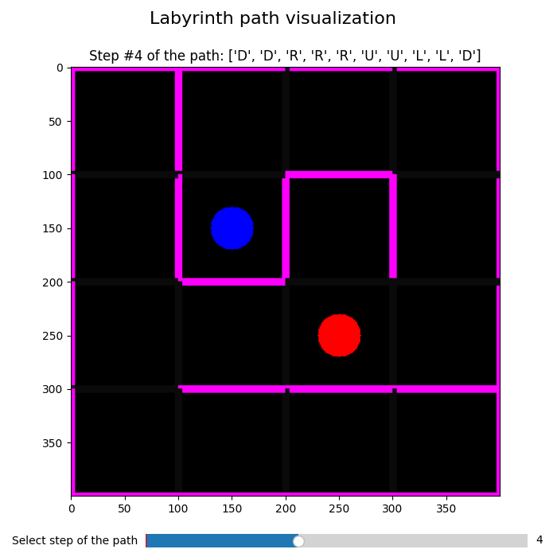

# Genetic solve of the labyrinth problem

В репозитории представлено решение задачи нахождения пути в лабиринте с помощью генетического алгоритма с использованием библиотеки `deap` (Distributed Evolutionary Algorithms in Python).

## Текст задания: [Paper labyrinth](https://www.codingame.com/training/medium/paper-labyrinth)

